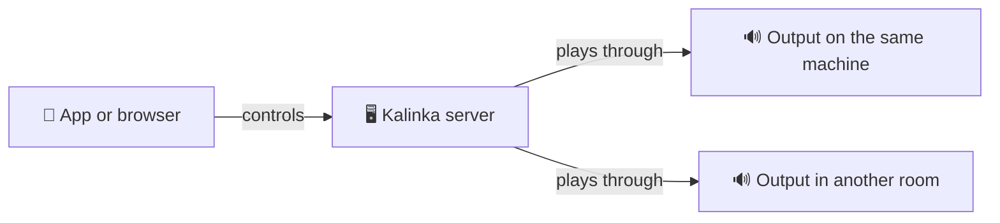

# Installing Kalinka

This guide gets Kalinka running on your own hardware: a Raspberry Pi, a spare PC, a virtual machine, or a Linux machine you already use. It takes five steps:

1. **[Install the server](#install-the-server)**, in one of four ways.
2. **[Get a remote](#get-a-remote)**: the Kalinka app, or any web browser.
3. **[Run the setup wizard](#run-the-setup-wizard)**, which asks where your music is and where the sound should come out.
4. **[Put your music on it](#put-your-music-on-it).**
5. **[Add more outputs](#add-more-outputs)**, if you want music in more than one room or in a browser tab.

After that, Kalinka [keeps itself up to date](#keeping-it-up-to-date). If something goes wrong, see [Troubleshooting](#troubleshooting).

## How Kalinka fits together

Kalinka has three parts, and they can all run on one machine or be spread across several:

- **The server** keeps your music library, runs search and holds the play queue. You need one, and it runs all the time.
- **An output** makes the sound. It runs on the machine that your DAC, amplifier or speakers are plugged into. Kalinka calls this program a *renderer*. The server's own machine gets one automatically, and you can add more.
- **A remote** is what you hold: the Kalinka app (Android, Windows, Linux) or any web browser. A browser tab can also be an output itself.



All of them must be on the same home network. They find each other by themselves.

## Install the server

| What you have | What to do | What it takes |
|---|---|---|
| A Raspberry Pi 4, Pi 400 or Compute Module 4 | [A. Flash the Raspberry Pi image](#a-raspberry-pi-image) | A memory card and 15 minutes |
| A spare PC, mini-PC or thin client (64-bit Intel or AMD) | [B. Flash the PC image](#b-pc-image) | A USB stick or USB disk |
| A home server that runs virtual machines (Proxmox, virt-manager, VirtualBox, Hyper-V) | [C. Run the PC image as a virtual machine](#c-virtual-machine) | Importing a disk image |
| A computer already running Debian 13, Raspberry Pi OS (64-bit) or Ubuntu 24.04. This includes the Pi 5, Pi 3 and Pi Zero 2 W. | [D. Install with one command](#d-install-with-one-command) | A terminal |

**Not sure?** If you have a Raspberry Pi 4, use the image (A): it has the fewest steps. A Pi 5, Pi 3 or Zero 2 W needs option D, because the image does not start on those.

**Using a DAC HAT?** The images play through USB DACs, HDMI and the Pi's headphone socket. They do not include drivers for most DAC HATs (HiFiBerry, IQaudio, Allo and similar boards). For a HAT, install Raspberry Pi OS and then [install Kalinka with one command](#d-install-with-one-command). Raspberry Pi OS includes the drivers these boards need.

Kalinka needs a 64-bit system. Playback and the library run in 512 MB of memory, and 1 GB is comfortable. AI search needs more: 2 GB should work, and 4 GB is what has been tested. See the [requirements](../README.md#-requirements) for details.

### A. Raspberry Pi image

The image is a complete system with Kalinka already installed. You write it to a memory card, put the card in the Pi and switch it on.

**You need:**

- a Raspberry Pi 4, Pi 400 or CM4, and its power supply;
- a microSD card of 8 GB or more, or a USB SSD. **Everything on it will be erased.** Kalinka uses all the space on the card, so buy a larger one if you plan to keep music on it;
- a network cable, if you can: it is the simplest way to connect. Wi-Fi works too, but needs the [settings file](#the-settings-file-wi-fi-and-a-login);
- a computer to write the card with;
- something to play through: a USB DAC, an HDMI receiver or TV, or the Pi's own headphone socket.

#### 1. Download the image

Open the [Kalinka image releases](https://github.com/Kalinka-Player/KalinkaPlayer/releases?q=kalinka-image-v&expanded=true). In the newest release, under **Assets**, download the file that ends in **`-rpi4-arm64.img.xz`**. It is about 550 MB. Do not unpack it: the writing tools read it as it is.

#### 2. Write it to the card

Install [Raspberry Pi Imager](https://www.raspberrypi.com/software/) (Windows, macOS, Linux), put the card in your computer, and open Imager.

1. **Device:** choose **Raspberry Pi 4**, then **Next**.

   

2. **OS:** scroll to the very bottom of the list, choose **Use custom**, and pick the `.img.xz` file you downloaded.

   

3. **Storage:** choose your memory card. Check the name and size carefully, because whatever you pick is erased.
4. **Customisation:** if Imager offers to set a user name, Wi-Fi or SSH, **skip it**. Those settings are for Raspberry Pi OS, and the Kalinka image does not use them. Kalinka has its own [settings file](#the-settings-file-wi-fi-and-a-login) for this.
5. **Write**, and wait until Imager has finished checking the card.

[balenaEtcher](https://etcher.balena.io/) works just as well: **Flash from file**, **Select target**, **Flash!**

#### 3. Wi-Fi or a login? Add the settings file

Skip this step if the Pi will use a network cable and you have no need to log in to it.

You need the [settings file](#the-settings-file-wi-fi-and-a-login) if you want either of these:

- the Pi on **Wi-Fi**;
- a **login** to the Pi, so you can copy music onto it over the network or use SSH.

#### 4. Switch it on

Put the card in the Pi, connect the network cable and your DAC, and plug in the power. Give it a couple of minutes to start, then go on to [Get a remote](#get-a-remote).

### B. PC image

This turns a spare 64-bit PC into a Kalinka player. The simplest way is to write the image to a USB stick or USB disk and start the PC from it. The PC's own disk is not touched. A small USB SSD lasts longer than a cheap stick.

**You need:** a 64-bit PC (almost any Intel or AMD PC from the last 15 years), a USB stick or disk of 8 GB or more (**it will be erased**), and a network cable if you can.

1. **Download:** from the [image releases](https://github.com/Kalinka-Player/KalinkaPlayer/releases?q=kalinka-image-v&expanded=true), download the file that ends in **`-amd64.img.xz`**.
2. **Write it** to the USB stick with [balenaEtcher](https://etcher.balena.io/) (**Flash from file**, **Select target**, **Flash!**) or with Raspberry Pi Imager (**Use custom**, as in [option A](#2-write-it-to-the-card)).
3. **Optional:** add the [settings file](#the-settings-file-wi-fi-and-a-login) for Wi-Fi or a login.
4. **Start the PC from the stick.** Plug it in, switch the PC on, and press the boot menu key straight away. This is usually F12, F11, F10, F8 or Esc, depending on the maker. Choose the USB drive from the menu. To start from it every time, move USB to the top of the boot order in the PC's BIOS or UEFI settings. Secure Boot can stay on.
5. Go on to [Get a remote](#get-a-remote).

<details>
<summary>Advanced: put Kalinka on the PC's internal disk instead</summary>

This erases the internal disk. Start the PC from any Linux live USB stick (Debian or Ubuntu live, for example), download the image there, and write it to the internal disk. Replace `/dev/sdX` with that disk; `lsblk` lists the disks.

```bash
xzcat kalinka-*-amd64.img.xz | sudo dd of=/dev/sdX bs=4M conv=fsync status=progress
```

Remove the live stick and restart. Kalinka grows to fill the whole disk on its first start.

</details>

### C. Virtual machine

The PC image also runs as a virtual machine. This suits a home server that is on all the time anyway. Read these four points first, because they are where VMs usually go wrong:

- **Use a bridged network, not NAT.** Your phone has to reach the VM directly, and the app finds the server by listening on the local network. Choose **Bridged Adapter** in VirtualBox, a **bridge** device in virt-manager, **vmbr0** in Proxmox (the default), or an **External** switch in Hyper-V. If the VM's screen shows an address starting with `10.0.2.`, it is on NAT.
- **Sound needs a plan.** A VM usually cannot reach your DAC. The usual setup is to let the VM be the server and [add an output](#add-more-outputs) on a small box next to your amplifier. You can also pass a USB DAC through to the VM. The VM's virtual sound card does appear as an output, but it plays through the host's sound system, so it is not bit-perfect.
- **Make the disk bigger before the first start.** The image is only 4 GB. Enlarge the virtual disk to 16 GB or more, or more again if you will keep music inside the VM. Kalinka grows into the extra space every time it starts, so you can enlarge the disk again later.
- **Give it 2 CPU cores and 2 GB of memory,** or 4 GB for AI search. UEFI and BIOS both work, and so does Secure Boot.

**1. Download and unpack** the file that ends in **`-amd64.img.xz`** from the [image releases](https://github.com/Kalinka-Player/KalinkaPlayer/releases?q=kalinka-image-v&expanded=true). On Linux or macOS run `xz -d kalinka-*-amd64.img.xz`; on Windows, [7-Zip](https://www.7-zip.org/) unpacks it. You get a `.img` file, which is a raw disk image.

**2. Import it** into your virtualisation software. Replace `kalinka.img` with the name of your file:

| Software | How |
|---|---|
| **virt-manager / QEMU** | `qemu-img convert -f raw -O qcow2 kalinka.img kalinka.qcow2` and then `qemu-img resize kalinka.qcow2 32G`. Create a VM with **Import existing disk image** and choose **Debian 13**. |
| **Proxmox VE** | Create a VM with no disk, then on the host run `qm disk import <vm-id> kalinka.img local-lvm`. Attach the imported disk, make it the boot disk, and resize it under **Hardware**. |
| **VirtualBox** | `VBoxManage convertfromraw kalinka.img kalinka.vdi --format VDI` and then `VBoxManage modifymedium disk kalinka.vdi --resize 32768`. Create a **Linux / Debian (64-bit)** VM that uses this disk, and set its network to **Bridged Adapter**. |
| **Hyper-V** | `qemu-img convert -f raw -O vhdx kalinka.img kalinka.vhdx`. Create a **Generation 2** VM that uses this disk, and set its Secure Boot template to **Microsoft UEFI Certificate Authority**. |

**3. Start the VM.** Its screen shows the address to open, as described in [Get a remote](#get-a-remote).

<details>
<summary>Adding the settings file to a VM</summary>

A VM has no memory card to take out, so add the [settings file](#the-settings-file-wi-fi-and-a-login) to the `.img` before you import it. On Linux, with `mtools` installed:

```bash
mcopy -i kalinka.img@@2097152 kalinka-firstboot.conf ::/kalinka-firstboot.conf
```

On macOS, double-click the `.img` file, or run `hdiutil attach -imagekey diskimage-class=CRawDiskImage kalinka.img`. A **KALINKA-BT** drive appears; copy the file onto it and eject it.

</details>

### D. Install with one command

Use this on a computer that already runs one of these 64-bit systems:

- **Debian 13** (trixie)
- **Raspberry Pi OS (64-bit)**, the current release based on Debian 13. This covers the Pi 5, Pi 4, Pi 3 and Zero 2 W.
- **Ubuntu 24.04 LTS**

Open a terminal on that computer, or log in to it over SSH, and run:

```bash
curl -fsSL https://kalinkaplayer.com/install.sh | sudo bash
```

It downloads the latest release and installs the server, its plugins, the browser player, and an output for this computer's own sound card. Everything starts straight away and again after every restart. It takes a few minutes. When it has finished, go on to [Get a remote](#get-a-remote).

<details>
<summary>Starting from a blank Raspberry Pi (Pi 5, Pi 3, Zero 2 W, or any Pi with a DAC HAT)</summary>

1. In [Raspberry Pi Imager](https://www.raspberrypi.com/software/), choose your Pi, then **Raspberry Pi OS (other)** → **Raspberry Pi OS Lite (64-bit)**, then your memory card.
2. At **Customisation**, set a host name (for example `kalinka`), a user name and password, your Wi-Fi if you need it, and turn on **SSH**. Unlike with the Kalinka image, this step is exactly what you want here.
3. Write the card, start the Pi, and log in from your computer: `ssh <your-user>@kalinka.local`.
4. For a DAC HAT, set it up now as its maker describes. This is usually one `dtoverlay=` line in `/boot/firmware/config.txt`, followed by a restart.
5. Run the install command above.

</details>

<details>
<summary>Options for the install command</summary>

You only need these in special cases.

| You want | Run |
|---|---|
| To read the script before running it | `curl -fsSL https://kalinkaplayer.com/install.sh -o install.sh`, read it, then `sudo bash install.sh` |
| A particular version | `curl -fsSL https://kalinkaplayer.com/install.sh \| sudo bash -s -- 5.0.0` |
| A server with no output on this machine, for example a NAS whose sound nobody hears | `curl -fsSL https://kalinkaplayer.com/install.sh \| sudo KALINKA_RENDERER=0 bash` |
| No browser player | `curl -fsSL https://kalinkaplayer.com/install.sh \| sudo KALINKA_WEB=0 bash` |

Running the command again upgrades whatever is installed. Kalinka normally [upgrades itself](#keeping-it-up-to-date), though.

</details>

<details>
<summary>Installing without the script</summary>

From the [latest server release](https://github.com/Kalinka-Player/KalinkaPlayer/releases/latest), download every file that ends in `_all.deb`, plus `SHA256SUMS`. Add `kalinka-web_…_all.deb` from the [latest app release](https://github.com/Kalinka-Player/KalinkaAI/releases/latest). For sound on this machine, add the renderer `.deb` whose name matches your system and processor, for example `debian-13.arm64` or `ubuntu-24.04.amd64`, from the [renderer releases](https://github.com/Kalinka-Player/KalinkaPlayer/releases?q=kalinka-renderer-v&expanded=true). Then, in the download folder:

```bash
sha256sum -c SHA256SUMS --ignore-missing
sudo apt install ./*.deb
```

</details>

<details>
<summary>Fedora</summary>

Fedora gets the server and the output, but not the browser player, and the app's upgrade button does not work there. Download `kalinka-server-…noarch.rpm` from the [latest server release](https://github.com/Kalinka-Player/KalinkaPlayer/releases/latest), then:

```bash
sudo dnf install ./kalinka-server-*.noarch.rpm
curl -fsSL https://kalinkaplayer.com/install-renderer.sh | sudo bash
```

To upgrade later, install the newer `.rpm` the same way.

</details>

## The settings file (Wi-Fi and a login)

The Kalinka images come with **no login and no Wi-Fi**. A published image cannot carry a password, because everyone who downloads it would get the same one. Kalinka plays music without either. You need them only to put the player on Wi-Fi, or to log in to it, for example to copy music onto it.

To set them, put a small text file called `kalinka-firstboot.conf` on the card before its first start:

1. After writing the card, unplug it and plug it back in. A drive called **KALINKA-BT** appears.

   > **Windows may say the disk needs formatting. Click Cancel.** That message is about the part of the card that Windows cannot read, and formatting would erase the image. macOS may say a disk is not readable: click **Ignore**.

2. The drive holds a file called `kalinka-firstboot.conf.example`. **Copy it** and name the copy exactly `kalinka-firstboot.conf`. Windows hides file extensions by default, so check the name does not end in `.txt`. Edit the copy rather than starting a new file, so the file keeps the right format.
3. Open the copy in a text editor. Every line in it is explained. Fill in what you need, for example:

   ```sh
   USERNAME=kalinka
   PASSWORD='choose-a-password'
   WIFI_SSID='Your network name'
   WIFI_PASSWORD='your Wi-Fi password'
   WIFI_COUNTRY=GB
   ```

   `WIFI_COUNTRY` is your two-letter country code: GB, US, DE, FR and so on. Leave out whatever you do not need. With a network cable, the two Wi-Fi lines can go.

4. Save the file, eject the card safely, and start the player.

The player reads the file on its first start, applies it, and then **deletes it**, because a Wi-Fi password should not stay on the card. If the file is still on the card after the first start, something in it could not be applied.

The same file also works later. Put it back on a player that is already in use and restart it.

<details>
<summary>PC image on Windows: the drive does not appear</summary>

On the PC image, **KALINKA-BT** is a boot partition, and Windows hides those. The simplest fix is to add the file from a Mac or a Linux computer. To do it from Windows, open a Command Prompt **as administrator** and run `diskpart`, then:

```text
list volume
select volume <number of the ~512 MB FAT32 volume labelled KALINKA-BT>
assign letter=K
exit
```

Open **Notepad as administrator**, open `K:\kalinka-firstboot.conf.example`, and use **Save as** to save it as `K:\kalinka-firstboot.conf`, with **Save as type** set to **All files**. File Explorer cannot open this drive, but an administrator Notepad can.

</details>

<details>
<summary>More secure alternatives to a plain-text password</summary>

Instead of `PASSWORD`, use `PASSWORD_HASH` with a hash made by `openssl passwd -6`. The password itself then never touches the card. To log in with an SSH key, set `SSH_AUTHORIZED_KEY` to the whole line from your `.pub` file. The example file explains both options.

</details>

## Get a remote

Give the player a couple of minutes after you switch it on. Then connect to it in one of two ways.

**With the Kalinka app (easiest).** Install it on a phone or computer on the same network; the [app's page](https://github.com/Kalinka-Player/KalinkaAI#-install) says which file to download for Android, Windows or Linux. The app searches the network and lists every Kalinka server it finds, with its address. A new server is called **My Kalinka Service** until you rename it. Tap it, then **Connect**.


**With a web browser.** Open `http://<address>:8000`, for example `http://192.168.1.50:8000`. Type the `http://` and the `:8000` in full. To find the address:

- the Kalinka app shows it under the server's name;
- your router's web page lists connected devices, and the player appears as **kalinka**;
- a screen plugged into the player shows it:

  

  This picture comes from a test VM on NAT. On a normal home network the address usually starts with `192.168.`

- on a machine where you ran the one-command install, `hostname -I` prints it.

## Run the setup wizard

Whichever remote you open, the **setup wizard** starts. It asks where your music is, which output to play through, and whether an amplifier handles the volume, and then it plays a test tone. The browser skips the first step, because it already knows which server it belongs to. The [first-run setup guide](https://github.com/Kalinka-Player/KalinkaAI/blob/main/docs/first-run-setup.md) explains every step.

## Put your music on it

Pick whichever of these matches where your music is. You can combine them: Kalinka treats each one as a **music source** of **My Library**.

**On a NAS or another computer.** No copying is needed. In the wizard, or later under **Server settings → Input modules → My Library → Music sources**, add a **Network share**. Enter the address of the NAS or computer, the shared folder, and a user name and password if the share asks for one. The server reads the share itself, so there is nothing to set up on the player.

**Copied onto the player.** Every Kalinka installation has a music folder, `/srv/kalinka/music`, that anyone may write to, and Kalinka reads it from the start. On the images, copying music there needs the login from the [settings file](#the-settings-file-wi-fi-and-a-login). Use a file-transfer program that speaks **SFTP**:

| On | Use |
|---|---|
| Windows | [WinSCP](https://winscp.net/): protocol **SFTP**, host = the player's address, your user name and password. Open `/srv/kalinka/music` and drag your albums in. |
| macOS | [Cyberduck](https://cyberduck.io/): **Open Connection** → **SFTP**, the same details. |
| Linux | In your file manager, open `sftp://<user>@<address>/srv/kalinka/music` (in GNOME Files: **Other Locations**). |
| Terminal | `scp -r ~/Music/* <user>@<address>:/srv/kalinka/music/` |

Albums appear once they have finished copying. Kalinka ignores files that are still changing.

**In another folder on the server's machine.** This includes a USB disk. Add it as a **Folder on the server**. The server runs as a user called `kalusr`, and it can only see files that every user may read. Most home folders need their access opened up once:

```bash
chmod o+X /home/<you>
chmod -R o+rX /home/<you>/Music
```

<details>
<summary>A USB disk on a player with no desktop</summary>

Kalinka does not mount USB disks by itself, so mount it once and permanently. `lsblk -f` lists the disks; note the **UUID** of yours. Then:

```bash
sudo mkdir -p /mnt/music
echo 'UUID=<your-uuid> /mnt/music auto nofail,ro 0 0' | sudo tee -a /etc/fstab
sudo mount -a
```

Add `/mnt/music` as a **Folder on the server**. `nofail` lets the player start normally when the disk is unplugged, and `ro` means Kalinka only ever reads the disk. For a disk formatted in NTFS, write `ntfs3` in place of `auto`.

A disk that a desktop opens by itself, under `/media/<you>/`, is usually private to your user, so `kalusr` cannot read it. Mount it as shown here instead.

</details>

After that, the library fills in by itself. First Kalinka finds your files, then it tidies their details online, and then, if you turned it on, it builds AI search. On a Raspberry Pi with a large collection, the first pass can take hours. Kalinka works normally in the meantime.

To improve how Kalinka repairs your tags, add a free [AcoustID](https://acoustid.org/) key in the server settings. Kalinka then recognises tracks by their sound as well as by their names.

## Add more outputs

An output is anywhere Kalinka can play. The server's own machine already has one. You can add two other kinds:

| Output | Good for | How |
|---|---|---|
| **Kalinka renderer** on another machine | The best sound: bit-perfect and gapless | Install it with one command (below) |
| **A browser tab** | Quick listening on a laptop, with nothing to install | Open `http://<address>:8000` and pick the browser from the output list. It is named after the browser, for example *Chrome on Windows*. There is no gapless playback and no bit-perfect guarantee. |

Any Linux computer near an amplifier or DAC can run a renderer: a Raspberry Pi of any model from the Zero 2 W up, an old laptop, or a mini-PC. It finds the server by itself and appears in the app's list of outputs.

**To set up a renderer on another machine:**

1. Give the machine a 64-bit Debian 13, Raspberry Pi OS (64-bit), Ubuntu 24.04 or Fedora system. For a Pi, follow steps 1–4 of *Starting from a blank Raspberry Pi* under [option D](#d-install-with-one-command), but not step 5, which would install a whole server. Choose a **host name** that says where it is, such as `livingroom`: the output is named after it (*Kalinka Renderer on livingroom*).
2. On that machine, run:

   ```bash
   curl -fsSL https://kalinkaplayer.com/install-renderer.sh | sudo bash
   ```

3. Within a few seconds it appears in the app, both under the cast icon in the player and in the wizard's **Audio output** step. Choose it, open its **gear** to pick the sound device (your DAC, HDMI and so on), and play the **test tone**.


A few things to know:

- The renderer must be on the **same network** as the server. Guest Wi-Fi, Wi-Fi with "client isolation" turned on, and separate VLANs all block it; see [Troubleshooting](#troubleshooting). Once it has found the server, it connects out to it, so nothing needs opening in the other direction.
- For an extra output, use plain Raspberry Pi OS Lite with the renderer command, **not** a second Kalinka image. The image always includes a server too, and a second server would then appear in the app.
- There is no renderer for Windows or macOS yet. On those computers, use a browser tab as the output.
- Other Linux systems can run the renderer as a flatpak, which has to be [built from source](../packages/kalinka-renderer/flatpak/README.md) for now. A renderer installed that way, or built from source, cannot replace itself, so it is never offered an upgrade.

## Keeping it up to date

Kalinka checks for a new release every hour. When there is one, the app offers an **upgrade** button. To have it upgrade by itself, turn on **Auto upgrade** in the server settings: it then installs between 3 and 6 in the morning, while nothing is playing.

The server, its plugins, the browser player and every renderer move together, and renderers go first, so that a renderer is never left too old to play for its server. A renderer that has fallen too far behind shows an upgrade button in the app's output list.

A renderer that nobody looks after can also update itself every night, without the server:

```bash
sudo systemctl enable --now kalinka-renderer-upgrade.timer
```

On the images, the operating system under Kalinka is an ordinary Debian. If you have a login, update it now and then with `sudo apt update && sudo apt full-upgrade`.

## Troubleshooting

**The app finds no server.** The phone and the player must be on the same network. Guest Wi-Fi, Wi-Fi with "client isolation", and a VM on NAT all hide the server. Use **Enter Address Manually** with `<address>:8000` to check whether the server itself is fine: if that works, only discovery is blocked.

**The browser cannot connect.** Wait two minutes after switching the player on. Type `http://`, not `https://`, and add `:8000` at the end.

**The Pi does not start.** Write the card again, and try another card if that fails. Use the official power supply. The image starts only on a Pi 4, Pi 400 or CM4.

**Wi-Fi or the login does not work.** Look at the card in your computer again. If `kalinka-firstboot.conf` is still there, the player could not apply it. Check that the file name is exactly right, with no hidden `.txt` on the end, and that any value containing spaces is inside quotes. Then start the player again.

**No outputs in the list, or no sound.** The output runs as a service of its own. On the player, `systemctl status kalinka-renderer` should say `active (running)`. If there is no sound, open the output's gear and try another sound device: HDMI, the headphone socket and a USB DAC are separate devices. Until an output works, you can listen in the browser.

**An output on another machine does not appear.** On that machine, run `journalctl -u kalinka-renderer -f`. A line containing `[Discovery] Found` means it has seen the server. No such line means the network is blocking discovery, and a line about `renderer_proto` means that server does not accept renderers at all. Put both machines on the same network, or point the renderer at the server's address directly:

```bash
sudo systemctl edit kalinka-renderer
```

In the editor that opens, add these lines, using your server's address, then save and run `sudo systemctl restart kalinka-renderer`:

```ini
[Service]
ExecStart=
ExecStart=/usr/bin/kalinka-renderer --server 192.168.1.50:8000
```

**The library stays empty.** The music folder is wrong, or the `kalusr` user cannot read it; see [Put your music on it](#put-your-music-on-it). A network share also needs the right user name and password.

**Logs.** In the app, **Server settings → General → Support → Download server logs** prepares a ZIP of the server's recent logs to attach to an issue. Kalinka removes passwords and keys from it, but it still contains file names and network addresses, so look through it before you post it. It needs a running server. When the server does not start, read the journal directly: `journalctl -u kalinka` for the server and `journalctl -u kalinka-renderer` for the renderer. Upgrades log under units of their own, so after a failed upgrade include those too. This saves the last day of all the server's units to a file you can attach:

```bash
sudo journalctl -u kalinka -u kalinka-upgrade -u kalinka-restart --since "1 day ago" > kalinka.log
```

For more detail in the logs, raise the `log_level` setting (search for it in the server settings).

**Asking for help.** Questions and reports are welcome in [the testing thread](https://github.com/Kalinka-Player/KalinkaPlayer/discussions/133). Something you can reproduce is easier to act on as an [issue](https://github.com/Kalinka-Player/KalinkaPlayer/issues).
