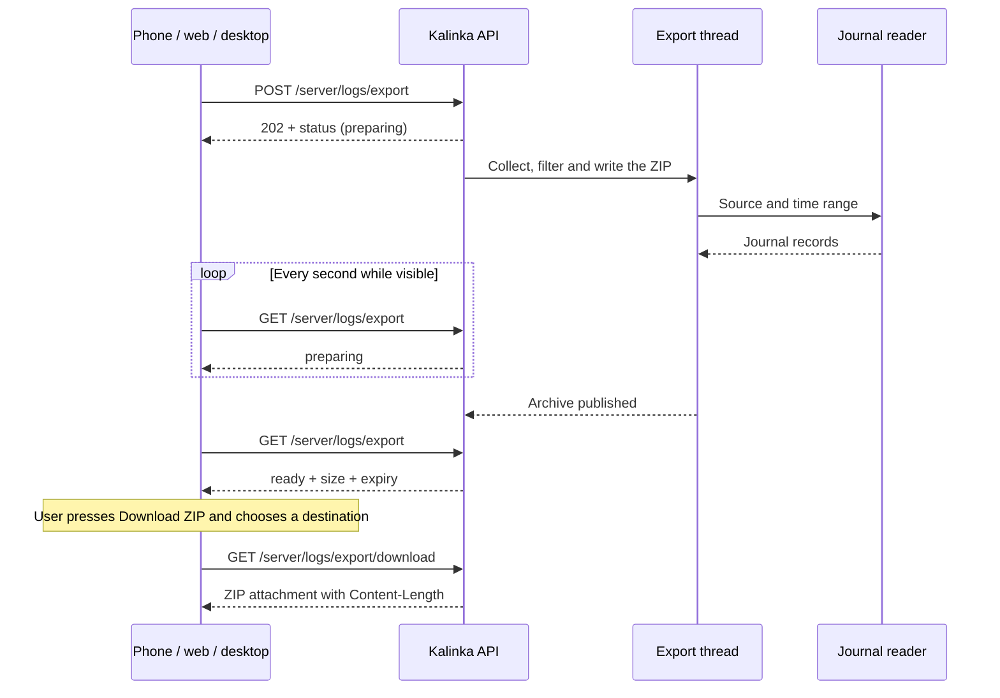

# Downloading server logs

Implemented: the server side in `kalinka-server`, the app side in the app repository.

The app asks the server to prepare an archive of its recent logs, shows that it is working, and offers **Download ZIP** once the archive is ready. Preparation belongs to the server; choosing a destination and downloading belong to the client. The archive stays on the Kalinka server until it expires or a new export replaces it.

**Sizing.** Measured on a Pi in August 2026, the whole system writes under 1 MB of log text a week at the default log level: the server about 0.6 MB, the renderer about 0.1 MB. A seven-day export is therefore well under a megabyte and compresses in milliseconds. Only reading the journal is slow — scanning months of retained journal on an SD card can take seconds — so the export runs in the background, but with a single open-ended "preparing" state rather than per-phase percentages. The text cap below exists for the `debug` log level, which can raise the volume many times over.

Use ZIP with DEFLATE compression. It holds several readable log files and a small manifest in one download; gzip suits a single file and would need tar for several. The API has no format selector.



**User interaction.** Add **Settings → Support → Download server logs**. Default to the last 24 hours, with 1-hour and 7-day alternatives. Offer **Include renderer logs from this server** only when the server lists that source as available (see *Sources*). It covers the renderer installed on the server's own machine, never a renderer elsewhere or the app itself.

After **Prepare logs**, show **Collecting logs…** with an indeterminate indicator and **Cancel**, then **Download ZIP · 96 KB** with the expiry time. A failed export shows its message and **Try again**. Warnings — history shorter than requested, a cap that dropped older records, an unavailable renderer source — appear as notes beside the ready download. A short note on the screen says the archive may contain file and track names, listening times, device names and network addresses.

Navigating away does not cancel the export. The screen reads the server's current export whenever it opens or returns to the foreground, and polls once a second only while it is visible and the export is preparing. A connection failure shows **Waiting for server**, not a failure. An export the screen last saw preparing that now reads as `none` was interrupted by a server restart: say so and offer **Prepare logs**. The export belongs to whichever server the app is connected to; switching servers reads that server's export instead.

**When the server is down.** The export is served by the server, so it is unavailable exactly when the server fails to start or keeps restarting — after a failed upgrade, for instance. The *Logs* entry under [Troubleshooting](installation.md#troubleshooting) gives the `journalctl` commands for that case; the export does not replace them.

**HTTP contract.** A server has at most one export, so it is a single resource under the existing `/server` API area, not a collection of jobs.

| Request | Result |
| --- | --- |
| `GET /server/logs/export` | The current export and the available sources; always `200`. |
| `POST /server/logs/export` | Start an export, replacing a finished one; `202` with its status. |
| `GET /server/logs/export/download` | The ready ZIP; `HEAD` reads its headers alone. |
| `DELETE /server/logs/export` | Cancel preparation or remove the archive; `204`. |

Start request:

```http
POST /server/logs/export
Content-Type: application/json

{
  "lookback_seconds": 86400,
  "include_local_renderer": false
}
```

Accept integer lookback values from 60 through 604800 seconds. Declare the body as a Pydantic model that forbids unknown fields, so invalid values and a non-JSON body get `422`; so does asking for a renderer source that is not available. A cross-site form cannot send a JSON body without a CORS preflight, which this server does not answer.

POST while an export is preparing returns `409` with code `export_in_progress` and the current export under `export`, and the client shows that export instead of starting another. The same answer covers a retried POST whose first response was lost: the retry finds the export it started. POST while an export is ready or failed replaces it, deleting a ready archive.

The status of a ready export:

```json
{
  "state": "ready",
  "available_sources": ["server", "local_renderer"],
  "requested_range": {
    "since": "2026-09-22T10:00:00Z",
    "until": "2026-09-23T10:00:00Z"
  },
  "download": {
    "filename": "kalinka-logs-20260923T100000Z.zip",
    "size_bytes": 96412,
    "expires_at": "2026-09-23T10:30:02Z"
  },
  "warnings": [],
  "error": null
}
```

`state` is one of `none`, `preparing`, `ready` and `failed`. `download` is set only when ready and `error` only when failed; `requested_range` is absent for `none`. Resolve the range once, when the POST is accepted, so polling never moves the cutoff. Each warning names its source and carries a code and a message.

POST moves `none`, `ready` or `failed` to `preparing`; the worker ends `preparing` in `ready` or `failed`; DELETE returns any state to `none`, and so does a ready archive's expiry. The manager applies every transition under one lock, and a DELETE that arrives before the worker's result is recorded always wins: a cancelled export never becomes ready.

DELETE during preparation sets the worker's cancel flag, closes its reader connection, waits for the thread to return, removes partial files and answers `204`. That is prompt, because the worker checks the flag between records and between ZIP chunks. DELETE of a ready export deletes the archive, and DELETE with nothing to remove is also `204`.

| Condition | API behavior |
| --- | --- |
| An export is preparing | POST returns `409`, code `export_in_progress`, with the current export. |
| Invalid request | `422`. |
| The required log source is not installed | POST returns `503`, code `log_source_unavailable`. |
| The worker fails after acceptance | Status is `200` with `state: failed` and a structured error. |
| Download when no archive is ready | `409`, code `export_not_ready`, with the current export. |

Errors use a stable code and a safe, user-facing message, for example `{"code":"logs_unreadable","message":"The server could not read its logs."}`. The worker's codes are `logs_unreadable`, `collection_timeout`, `insufficient_storage` and `export_failed`. Never put exception text or local paths in an HTTP message. Send `Cache-Control: no-store` on every response.

**Sources.** A source is a fixed set of units rendered into one file:

| Source | Archive entry | Journal units |
| --- | --- | --- |
| `server` | `server.log` | `kalinka.service`, `kalinka-upgrade.service`, `kalinka-restart.service` |
| `local_renderer` | `local-renderer.log` | `kalinka-renderer.service`, `kalinka-renderer-upgrade.service` |

The upgrade and restart units belong to the server source because a failed upgrade is the likeliest reason to ask for logs, and their output never reaches `kalinka.service`'s journal. Each line carries its unit's name, so the interleaved file reads in order: the upgrade, the restart, the server starting again. Asking the journal by unit also brings systemd's own messages about each unit — a start, an exit status, a kill — which are often the answer. A unit with no records is normal (the RPM ships no upgrade units); warn only when a whole source has none.

`local_renderer` is available when the renderer package's unit file `/usr/lib/systemd/system/kalinka-renderer.service` exists, the same check the server's postinst makes. The Flatpak renderer runs as a user unit in its user's journal and is out of scope.

Production logs go to journald: the server's entry point installs stream handlers and the renderer runs in the foreground, and nothing writes `/var/log/kalinka`. The developer launcher instead tees the server's output into `paths.log_dir()/server.log`. The server picks its backend the way `logging_setup.stream_is_journal` picks a log format: when its standard error is the journal, it reads the journal through the reader below; otherwise it reads the developer's file and offers no renderer source.

**Collection.** Ask for the requested interval across boots, not only the current boot. Read newest records first, stop at the source's share of the text cap, then write the retained records oldest first; the newest records survive the cap and a slow scan can stop early. Render structured records as readable timestamped lines, never raw journal data. Cap a single record at 64 KiB and mark the cut. Record each source's actual first and last timestamps: history that starts after `since` — vacuumed, or a volatile journal lost at reboot — is a warning, never complete coverage.

A source tells "nothing in range" apart from "cannot read": an accessible source with no records yields an empty file and a warning. A failed `server` source fails the export; a failed `local_renderer` source leaves a ready archive with a warning. The retained text stays in memory, within the cap, and a record that carries a credential is dropped before anything reaches the disk.

**The journal reader.** The service user `kalusr` cannot read the system journal, and the unit runs with `NoNewPrivileges=yes`. A small socket-activated reader bridges that:

- `kalinka-journal-reader.socket` listens on `/run/kalinka-journal-reader.sock` with `SocketGroup=kalusr`, `SocketMode=0660` and `Accept=yes`; the socket's permissions are the peer check. It stays out of `/run/kalinka`, which systemd removes whenever the server stops.
- `kalinka-journal-reader@.service` runs once per connection with `DynamicUser=yes` and `SupplementaryGroups=systemd-journal`, so packaging creates no user. It needs no network, writable storage or root: add `PrivateNetwork=yes`, `ProtectSystem=strict`, `ProtectHome=yes` and a `RuntimeMaxSec=` just above the preparation deadline.
- Its executable, the stdlib-only module `kalinka_server.journal_reader` run by the venv's interpreter, reads one JSON request — a source name and two Unix timestamps — validates it, and runs a fixed `journalctl` argument vector without a shell: the source's `--unit=` flags, `--since=@<since> --until=@<until>` (epoch form, so no time zone is parsed), `--reverse`, `--output=json` and `--output-fields=` limited to the message, unit and priority. It accepts no command, arbitrary unit, directory or path. It streams records back, and kills and reaps `journalctl` when the connection closes.

Two simpler routes were considered and rejected. `SupplementaryGroups=systemd-journal` on `kalinka.service` is one line, but it lets the server — and every third-party plugin in its process tree — read the whole system journal of what is often a general-purpose machine. A file handler writing into the unit's existing `LogsDirectory=kalinka` misses the startup script's output, crashes, systemd's messages about the unit and the renderer, and doubles the writes to an SD card.

**Developer file source.** Without systemd, read `paths.log_dir()/server.log`, the one file [dev_run.sh](../scripts/dev_run.sh) appends to; it never rotates. Open it without following symlinks, read backwards from the length seen at open, and keep traceback lines with the record they follow. The full log format starts each record with its timestamp, which the time filter uses. Under `KALINKA_LOG_FORMAT=journal` records carry none: include the newest records up to the cap, set `time_filter_applied: false` in the manifest and warn.

**Archive.** The entries are `server.log`, `local-renderer.log` when requested, and `manifest.json`, always under those names. The manifest records a schema version, the Kalinka and plugin versions, the OS version and CPU architecture, the requested range, and for each source its units or file, backend, actual first and last timestamps, record and byte counts, truncation and whether the time filter applied. Never include configuration, databases, music listings or the rest of the journal.

**Withholding credentials.** Logs should not carry a credential in the first place — the project rule, `quiet_credential_carrying_loggers`, and the pull-request check [check_credential_logging.py](../scripts/check_credential_logging.py) that flags code passing a credential to a log see to that — so the export's filter is the second line of defence. It never masks part of a line: a record that looks like it carries a credential is left out whole, and the archive's warnings and manifest say how many were. `credential_detector()` in [config_secrets.py](../packages/kalinka-server/src/kalinka_server/config_secrets.py), the one place that already decides what a credential is, flags a record holding the current value of any field `is_secret` marks, across the server's and the modules' configuration, also percent-encoded; a password written into a URL; or a credential-named header, query parameter or key-value pair with a value, by the same name rule the pull-request check uses ([credential_names.py](../packages/kalinka-server/src/kalinka_server/credential_names.py)). It errs towards leaving a record out. The worker holds the secret values in memory only and never logs them. Detection is best effort, which is why the screen carries its privacy note.

**Worker and lifecycle.** Add an `ExportManager` on `app.state`, opened and closed in the lifespan like the existing services. It holds the one export in memory; nothing about it is persisted. The single Uvicorn process makes that sufficient, and several worker processes would need a shared lock first.

Preparation runs in one worker thread (`asyncio.to_thread`): collect, withhold, write `archive.zip.part`, rename it to `archive.zip`, and hand the result back to the manager, which records `ready` under its lock. A `threading.Event` carries cancellation and the deadline into the thread, which checks it between records and between ZIP chunks; closing the reader's socket unblocks a pending read. A worker that misses the deadline stops the same way and the export fails with `collection_timeout`. zlib releases the GIL while it compresses and the filter works record by record, so the event loop stays responsive — the acceptance checks confirm this rather than assume it.

Files live in `paths.cache_dir()/log-export/`, a 0700 directory holding 0600 files, since the cache directory itself is 0755. At startup, empty that directory: an export does not survive a restart, and preparing a new one takes seconds. The archive expires 30 minutes after it becomes ready; a timer deletes it and returns the state to `none`. A write that fails for lack of space fails the export with `insufficient_storage` and removes the partial file.

| Limit | Default |
| --- | --- |
| Concurrent preparations | 1 |
| Collected log text | 8 MiB, split 6 MiB server and 2 MiB renderer when both are included; newest records win |
| Single record | 64 KiB, marked when cut |
| Preparation deadline | 60 seconds |
| Archive lifetime | 30 minutes after it becomes ready |

A ZIP of text is never larger than the text, so the text cap also bounds the disk footprint; no separate archive or cache limit is needed.

**Download response.** Serve the archive with Starlette's `FileResponse`, registering GET and HEAD together as [content_route.py](../packages/kalinka-server/src/kalinka_server/content_route.py) does:

```http
HTTP/1.1 200 OK
Content-Type: application/zip
Content-Disposition: attachment; filename="kalinka-logs-20260923T100000Z.zip"
Content-Length: 96412
Cache-Control: no-store
X-Content-Type-Options: nosniff
```

`FileResponse` opens its file only after sending the headers, so each download first takes a hard link to the archive and removes it when the transfer ends, however it ends. Expiry, DELETE or a replacing POST can then delete the archive at any moment: a transfer already running completes, and later requests get `409`. It also answers `Range` requests on its own; no client depends on them. Do not set `Content-Encoding` or let middleware compress the ZIP.

**Access.** The API has no authentication, so any client on the LAN can prepare and download logs, just as it can already read the queue and change the configuration. The archive holds listening history and network details, which the privacy note tells the user. The export's URLs are fixed and carry nothing secret, so access logs need no scrubbing. Checking `Origin` and `Host` — which would also stop a DNS-rebinding page from driving the API — is a server-wide policy for every mutation and belongs in its own change. A future authenticated server authorizes these routes like any other.

**Client saving behavior.** One status model and polling controller across platforms, with a small platform adapter behind `saveExport()`.

| Client | What Download ZIP does |
| --- | --- |
| Browser, including a mobile browser | Re-read the status, then follow the download URL from the user's click and let the browser manage the transfer and any save prompt. |
| Android app | **Save** opens the Storage Access Framework with `ACTION_CREATE_DOCUMENT`, type `application/zip` and the suggested filename, then streams the response into the returned content URI through `ContentResolver`. **Share** downloads into the app's cache and opens the share sheet, the short path to an email or a GitHub issue. |
| Desktop app (Linux, macOS, Windows) | Open the native Save As dialog, stream into a temporary file in the chosen directory, and rename it into place after a complete download. |

The app does not ship on iOS. An iOS build would use the share sheet alone, which covers both saving (**Save to Files**) and sending.

On web, do not fetch the ZIP into a Blob: a plain attachment download keeps the file out of the app and uses the browser's download UI. `Content-Disposition` is the contract; the `download` attribute is optional help for same-origin links. Start the download only from the user's press, never automatically when preparation finishes, and re-read the status first so an expired archive shows **Prepare logs** rather than an error page. The web UI can say **Download started** but cannot know that the file was saved.

On Android, a plain Dart HTTP request cannot open the system picker; a small platform channel invokes it and writes to the content URI, which is not a filesystem path. No storage permission is needed for a document the user picked. Desktop save dialogs come from `file_selector`, which offers no save location on Android, so one call does not cover every platform. **Share** uses `share_plus`. Both packages are new dependencies of the app.

Native clients show download progress as bytes received over `Content-Length`. Cancelling the picker leaves the archive available. A cancelled or failed transfer removes the partial file or document where the platform allows and leaves the archive for a retry. If the archive expires while the picker is open, return to **Prepare logs**. Saving does not delete the export; expiry does. Native transfers stay in the foreground.

**Implementation boundaries and verification.** Route models and handlers go in `log_export_route.py`; the `ExportManager` in `log_export_service.py`; a `LogSource` interface with its journal and file implementations in `log_sources.py`; assembling sources into the ZIP and manifest in `log_archive.py`; the credential filter in `config_secrets.py`, its name rule in `credential_names.py`. The reader's units live in `packages/kalinka-server/scripts/` beside the restart units, its executable in the server's wheel so the units it reads are listed once, and both the Debian package and the RPM spec install them; the appliance image gets them through the deb. Mount the routes before the web UI fallback. The Flutter app needs the status model, the Support screen, polling and the platform save adapters.

Acceptance checks should cover: prepare, poll and download end to end; POST while preparing returning the running export; POST after ready replacing it; cancelling during collection returning promptly and leaving no files; a DELETE racing publication never yielding `ready`; the deadline; the text cap keeping the newest records and warning; an empty source versus an unreadable one; journal history across boots, and a warning when it is shorter than requested; a failing renderer source leaving a ready archive; records holding a configured secret, a URL password or a credential-named pair left out whole and counted; HEAD and repeated downloads; a download that keeps running through expiry, DELETE and replacement; startup cleanup; the reader rejecting malformed requests and unknown sources and killing `journalctl` on disconnect; playback and ordinary API requests staying responsive during an export. Manually verify a mobile browser, Android's document picker and share sheet, and the Linux, macOS and Windows save dialogs, including cancelled pickers and interrupted downloads.

Relevant existing code: [logging setup](../packages/kalinka-server/src/kalinka_server/logging_setup.py), [server entry point](../packages/kalinka-server/src/kalinka_server/__main__.py), [server service](../packages/kalinka-server/scripts/kalinka.service), [renderer service](../packages/kalinka-renderer/scripts/kalinka-renderer.service), [credential handling](../packages/kalinka-server/src/kalinka_server/config_secrets.py), [filesystem paths](../packages/kalinka-plugin-sdk/src/kalinka_plugin_sdk/paths.py), [developer launcher](../scripts/dev_run.sh) and [existing file serving](../packages/kalinka-server/src/kalinka_server/content_route.py).

Platform references: [Starlette file responses](https://starlette.dev/responses/#fileresponse), [browser download behavior](https://developer.mozilla.org/en-US/docs/Web/HTML/Reference/Elements/a#download), [Content-Disposition](https://developer.mozilla.org/en-US/docs/Web/HTTP/Reference/Headers/Content-Disposition), [Android document saving](https://developer.android.com/training/data-storage/shared/documents-files#create-file), [Flutter file_selector](https://pub.dev/packages/file_selector), [Flutter share_plus](https://pub.dev/packages/share_plus), [systemd socket units](https://www.freedesktop.org/software/systemd/man/latest/systemd.socket.html), [DynamicUser](https://www.freedesktop.org/software/systemd/man/latest/systemd.exec.html#DynamicUser=), [journalctl](https://www.freedesktop.org/software/systemd/man/latest/journalctl.html) and [journal JSON format](https://systemd.io/JOURNAL_EXPORT_FORMATS/).
