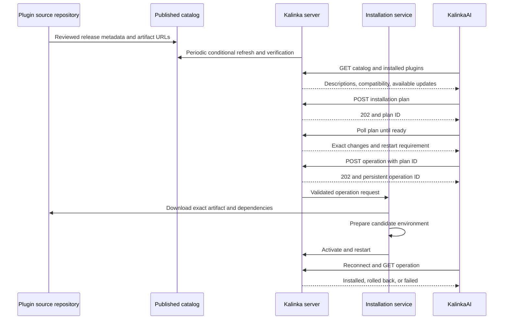

# Plugin catalog and installation design

Design, 1 October 2026. This document describes discovery, installation from plugin source repositories, compatibility checks, and automatic updates for KalinkaAI and the Kalinka server. The curated catalog now lives in [Kalinka-Player/kalinka-plugins](https://github.com/Kalinka-Player/kalinka-plugins). The accompanying [repository scaffold](../plugin-catalog/README.md) and app mocks are retained as investigation artifacts, not a second maintained catalog. The hub's native-package contract supersedes the original wheel-first packaging proposal below. The backend is being introduced in read-only stages; installation and unattended updates are not yet enabled.

**Chosen UI:** expandable entries within one Plugins destination, with Input sources and Device control filters. The separate detail-page alternative is superseded. Plugin type is a required curated copy of the SDK declaration; output-device entries must include searchable supported models, families, or both, plus readable requirements and limitations. These fields are implemented in the hub schema and entries. The Flutter app now implements read-only browsing behind an expert setting that defaults to false. The backend evaluates declared host compatibility; production identity reconciliation, dependency resolution and installation remain pending.

Use GitHub for reviewing catalog entries and hosting plugin releases. Publish a small, versioned JSON catalog over HTTPS, and have the **server** fetch it, select compatible releases, and expose the results to KalinkaAI. Authors build packages in their source repositories; the catalog contains their exact download URLs and checksums. Registered installations can follow these releases automatically. Unregistered installations remain usable and receive no automatic updates.

The chosen delivery mechanism is native DEB/RPM packages for managed Linux hosts; wheels may remain inside those packages. Today, plugins share the server's Python environment. Native packages do not remove dependency conflicts or provide atomic application-health rollback. Installation belongs in an independent supervised worker, not an HTTP request handler. The earlier wheel environment-switch alternative is retained below for context, not as the selected backend.

## What already exists

These findings come from the checked-out source, rather than assumptions about the deployed app.

| Existing component | Implication for this feature |
| --- | --- |
| [`player_setup.py`](../packages/kalinka-server/src/kalinka_server/player_setup.py) discovers `kalinka.plugins` entry points and imports plugin classes. | Discovery can continue unchanged, but inventory must also record distributions that fail to import or are disabled. |
| [`sdk_compat.py`](../packages/kalinka-server/src/kalinka_server/sdk_compat.py) checks installed SDK metadata and each class's `REQUIRES_SDK`. | Keep these runtime guards and add compatibility checks before installation. Class guards run after import, so they do not protect the installer. |
| [`version.py`](../packages/kalinka-server/src/kalinka_server/version.py) distinguishes package and REST API versions. | Plugin `requires.server` means the server package version. App compatibility uses the separate REST contract version. |
| [`bootstrap.sh`](../packages/kalinka-server/scripts/bootstrap.sh) installs packaged wheels into `/opt/kalinka/venv` on startup, including a fallback that tries wheels separately. | An independent installer must replace this reconciliation behavior for managed installations; otherwise a restart can overwrite its work. |
| [`kalinka.service`](../packages/kalinka-server/scripts/kalinka.service) runs the server as `kalusr`, with a privileged bootstrap and a root-owned environment. | HTTP handlers cannot directly install packages. The installation worker must outlive the server process. |
| [`update_check.py`](../packages/kalinka-server/src/kalinka_server/update_check.py) caches hourly bundle checks and supports quiet-hour upgrades. | Reuse its scheduling approach, while keeping plugin results and policies separate. Coordinate both installers with one lock. |
| [`RELEASING.md`](../RELEASING.md) versions five first-party plugins with the server bundle. The [RPM](../packages/kalinka-server/rpm/kalinka-server.spec) owns all their wheels in one package. | Initially show these as bundled plugins and update them through the existing bundle mechanism. Independent releases require an explicit packaging migration. |
| [`install_pending.py`](../packages/kalinka-server/src/kalinka_server/install_pending.py) installs optional dependencies using package-shipped allowlists. | Optional installs must eventually use the same environment planner and lock; otherwise they bypass dependency and rollback guarantees. |

The source contains Local Files, Jamendo, MusicCast, UPnP, and Dummy Device. Their distribution names, entry-point names, and `PLUGIN_ID` values differ: for example, `kalinka-plugin-jamendo`, `kalinka_plugin_jamendo`, and `jamendo`. Record all three explicitly. The seed catalog uses these facts; it does not invent releases or claim cross-platform testing based on a pure-Python wheel.

The plugin template already produces wheels and Debian packages. Some prose in [the Debian packaging guide](plugin-deb-packaging.md) predates the current SDK dependency pins; the implementation and current package metadata are the evidence for this proposal. UI implementation is in the sibling `KalinkaAI-1` checkout. Its `docs/mocks/plugin-catalog` directory retains the interactive alternatives and rationale; mocks are not removed or replaced by the implementation.

## Hosting and ownership

GitHub is a good initial home: pull requests provide review and history, and each author can keep artifacts with their own source. A database-backed registry is unnecessary at this scale. Keep a configurable catalog base URL so hosting can later move to object storage or a CDN without an app update. A possible future base URL is `https://kalinkaplayer.com/plugins/`; this is a proposed address, not a deployed service. See [public access and hosting](#public-access-and-hosting) for the implemented configuration.

Devices fetch static catalog data, not repository clones or one GitHub API request per plugin. Unauthenticated GitHub REST requests share a limit of 60 per hour per source IP; a static catalog also avoids coupling the app to GitHub's API. [GitHub rate limits](https://docs.github.com/en/rest/using-the-rest-api/rate-limits-for-the-rest-api)

| Option | Assessment |
| --- | --- |
| GitHub source catalog plus static HTTPS publication | Recommended. Low operational cost, public review, portable format. Publication and signing remain maintainer responsibilities. |
| GitHub Releases or PyPI without a catalog | Good artifact hosts, but insufficient for Kalinka curation, SDK requirements, supported hardware, and update policy. |
| Signed APT or RPM repositories | Good for native packages and system dependencies. Useful alongside this design, but do not cover every Python/server deployment or the app's discovery metadata. |
| Hosted registry API and database | Consider when private plugins, accounts, paid distribution, or complex search justify operating a service. |
| App polls every author's repository | Duplicates compatibility logic across clients and requires the app to stay open for updates. Prefer server-owned checks. |

Use `tier: official | unofficial` for maintenance authority and `maturity: stable | experimental | deprecated` for readiness. These are independent: an official plugin can be experimental. **Input sources** (`type: input_module`) and **Device control** (`type: output_device`) are prominent catalog filters. Within a type, group experimental entries under **Experimental**, otherwise under **Official** or **Unofficial**, retaining publisher information. In All, separate the two functional families. Deprecated entries are hidden from default browsing but remain visible when installed. `categories` contains descriptive search tags, not plugin type. Unknown future tags are displayable; unsupported type values and unknown security or schema semantics are not silently accepted.

Catalog maintainers assign tiers and verify source ownership during registration. Authors cannot promote themselves to official through a release manifest. Ownership transfers require review and retain the stable plugin ID. IDs, distribution names, and entry-point names cannot be reassigned to a different publisher. A renamed or deleted GitHub repository must not automatically acquire an existing plugin's identity.

## Repository and metadata contract

The standalone hub contains:

```text
kalinka-plugins/
  README.md
  CONTRIBUTING.md
  catalog.json                # Generated unsigned public browsing feed
  schemas/plugin.schema.json
  plugins/<plugin-id>.json
  examples/example-plugin.json
  tools/catalog.py
  tests/test_catalog.py
  .github/workflows/validate.yml
```

One JSON document per plugin keeps changes easy to review. CI produces one deterministic `catalog.json` from these documents, containing `schema_version`, `catalog_id`, a source `revision`, and `plugins`. JSON avoids requiring a YAML parser on devices. An empty `releases` list means **Listed, no catalog release available**, never **Install latest from somewhere else**. The hub includes native Spotify and Qobuz releases; bundled entries have no independent releases. The retained local scaffold predates those additions.

The [hub schema](https://github.com/Kalinka-Player/kalinka-plugins/blob/main/schemas/plugin.schema.json) defines the current catalog contract. The retained [synthetic example](../plugin-catalog/examples/example-plugin.json) illustrates the earlier portable-wheel alternative; it is excluded from generated catalogs and its download addresses are intentionally nonfunctional.

| Metadata | Meaning |
| --- | --- |
| `id`, `distribution`, `entry_point` | Stable Kalinka ID, normalized Python distribution name, and entry-point name in `kalinka.plugins`. |
| `name`, `description`, `creator`, `maintainers`, `license` | Display information, original authorship, and current maintainers. Never execute or render embedded HTML. |
| `source.repository`, `source.subdirectory` | Source location; the subdirectory supports this monorepo and independent repositories equally. |
| `type` | Required `input_module` or `output_device`, matching the SDK's `PLUGIN_TYPE.value`. |
| `device_support.models`, `families`, `notes` | Required for output devices only. Searchable model and family name arrays, at least one nonempty; readable requirements and limitations in notes. |
| `tier`, `maturity`, `categories`, `delivery` | Catalog classification; `delivery` is `bundle` or `independent`. |
| `releases[].version`, `channel`, `published_at` | Python package version, stable/preview channel, and publication timestamp. Keep older compatible releases. |
| `releases[].source_tag`, `source_commit`, `release_notes` | Traceability to a tagged commit and human-readable release notes. |
| `releases[].requires` | Server, SDK, Python and optional renderer version specifiers; OS and userspace architectures; named capabilities; operational requirements. |
| `releases[].artifacts[]` | Package format, filename, OS, architectures, exact HTTPS URL, SHA-256 and byte length. Native artifacts additionally declare exact package identity and distro/version targets. |
| `withdrawn`, `withdrawal_reason` | A release that must not be offered for installation or update. Keep its identity for installed-device reporting. |
| `data_rollback`, `rollback_versions` | `compatible` names the versions that can still read data after the release runs; `manual` requires a separate recovery procedure and excludes unattended updates. |

Version ranges use `packaging.specifiers.SpecifierSet`; ordering uses `packaging.version.Version`. Do not compare strings or Debian version strings as Python versions. An artifact with the same plugin version but different bytes requires a new version; moving a download URL is acceptable only when the digest remains unchanged.

OS and architecture are separate constraints. `platform: all` means no OS restriction; `architectures: ["all"]` means architecture-independent. Both release-level and artifact-level requirements must match the server. Native DEB/RPM records are Linux-only and use explicit distro/version allowlists. Portable wheel adapters, if added later, must also check the interpreter's [wheel compatibility tags](https://packaging.python.org/en/latest/specifications/platform-compatibility-tags/), including ABI/libc constraints, rather than selecting an arbitrary first match.

`requires.platforms: ["all"]` never bypasses dependency or deployment checks. A Debian package marked `Architecture: all` is not cross-platform. Native records are implemented in the standalone hub schema; the retained wheel-only scaffold is not authoritative.

`requires.capabilities` contains recognized facts the server can probe, such as an installed system library. Unknown or unsatisfied capabilities block installation with a reason. `requires.notes` explains requirements such as a Jamendo client ID or a MusicCast device; those normally lead to configuration after installation. Catalog metadata cannot provide arbitrary commands to install system libraries or probe the machine.

## Input sources and device support

Input-source plugins add music services or libraries without depending on an amplifier brand. Device-control plugins add optional amplifier/AVR controls through a particular protocol, such as a local network API or RS-232. These are separate catalog families, independent of publisher tier, maturity, server platform and update ownership. Each entry has one type, matching the current SDK's single `PLUGIN_TYPE`; dual-type support would require an explicit SDK/catalog extension.

The catalog does not introduce another plugin classification mechanism. Copy `PLUGIN_TYPE.value` from the plugin's `InputModulePlugin` or `OutputDevicePlugin` class into the required `type` field. Authors may generate this in their own build/test pipeline; curators verify it from reviewed source and test evidence. Catalog validation checks the declared value without installing or importing plugins. Browsing uses the curated declaration before installation.

After installation, the server retains its existing type detection and consistency checks from [`plugin.py`](../packages/kalinka-plugin-sdk/src/kalinka_plugin_sdk/plugin.py). Record `declared_type`, `detected_type` and reconciliation status separately. Use detected type for loaded-plugin controls and configuration, including unregistered plugins; never override it with catalog metadata. A mismatch is a visible metadata discrepancy requiring review, not permission to reinterpret a plugin or move settings. Hold unattended catalog updates for the mismatched binding until resolved. An import failure leaves detected type unknown and the declared type visibly unverified; it is not a third plugin type. Type detection grants neither catalog registration nor automatic updates.

The existing MusicCast entry has `type: output_device`. Its implementation advertises volume read/set, power on/standby and power readiness in [`supported_functions`](../packages/kalinka-plugin-musiccast/src/kalinka_plugin_musiccast/musiccast.py). It also switches to the configured input; it does not expose a generic input picker or mute function. Its readiness result combines power with selection of that configured input. Do not simplify this into an unqualified claim of raw power-status reporting. Discovery reads a model name, but the inspected catalog does not establish a verified model list. Marantz remains a future proposal, not a published or installable entry.

The current schema requires an output device's `device_support` object with `models`, `families` and `notes` arrays. At least one of models or families must contain a nonblank name; the other may be empty. Notes must explain requirements or limitations. Include manufacturer names in model/family labels so they are readable and searchable on their own. Input modules omit this object. The MusicCast seed uses a Yamaha MusicCast / Yamaha Extended Control family and explicitly disclaims verified exact-model coverage; Dummy Device declares a simulated-device family, not support for physical hardware. A [synthetic device example](../plugin-catalog/examples/example-device-plugin.json) demonstrates both arrays without inventing real supported products.

Index model and family names alongside plugin name, description and descriptive tags; display the scope and notes inside the expanded row. A case-insensitive family/name search is discovery, not compatibility proof. Never turn a family match or brand substring into a green exact-model verification result. These top-level fields describe current curated scope; release-specific compatibility needs the extension below and must not be inferred for an older installed release.

Beyond those implemented display/search fields, the following is a **proposed contract extension**, not yet accepted by `plugin.schema.json` or implemented by the scaffold tools. Review it before adding machine-verifiable per-release support claims:

| Proposed metadata | Purpose |
| --- | --- |
| `device_support.manufacturers` | Normalized manufacturer IDs and display names; never treat brand alone as compatibility. |
| `device_support.transports` | Named protocol/version, network or serial transport, and setup requirements. RS-232 support also needs serial settings and an actual command protocol. |
| Release-scoped `device_support.capabilities` | Enumerated control IDs with `supported`, `conditional`, `unsupported` or `unknown`, plus conditions. Keep volume read/write, mute, power read/on/standby and arbitrary/configured input switching distinct. |
| Release-scoped model records | Extend the current readable model/family lists with exact IDs, aliases, hardware/region variants, firmware range, zone, transport and per-model capability overrides. Never infer a wildcard family guarantee from one tested model. |
| Model verification | `verified`, `reported`, `protocol_only`, `unsupported` or `unknown`, tested plugin version, date and evidence URL. Publisher statements and independent reports remain distinguishable. |

Support records must be tied to releases, including a bundle version for bundled plugins. A large model matrix can be a separate versioned, hashed catalog target; it must be covered by the same signed publication and size limits. Plain display labels and structured conditions are allowed, not executable matching rules or probe commands.

The server returns separate `server_compatibility`, `device_match` and `effective_capabilities` results. An illustrative response might be `metadata_compatible`, `device_match: unknown`, and an empty set of verified device capabilities. “Runs on Linux arm64” must never imply “works with your AVR.” Distinguish catalog-verified model coverage from what the connected device currently reports, including the observation time and zone. Device addresses, credentials and serial port paths remain local configuration, not public catalog metadata.

Allow model/alias search within the expanded plugin entry, with bounded results and no extra navigation screen. No match means **Not verified**, not **Unsupported**. A disconnected device is **Not checked**, not **Incompatible**. Offer a user-initiated, read-only connection check only through an already installed trusted plugin or a trusted server probe; never import a downloaded plugin during browsing, and never test by changing volume, input or power. Network probing needs its own server-side destination checks and timeouts; catalog data cannot grant arbitrary network or serial access.

An unknown model need not block package installation, but warn before enabling device control. Explicitly unsupported models cannot be presented as usable. Re-evaluate the configured model, firmware, transport, zone and required controls when planning an update. If support disappears, becomes unknown or loses a required control, exclude unattended application and explain the change for manual review. Server/SDK compatibility alone is insufficient for this decision.

The target KalinkaAI design keeps **Browse**, **Installed** and **Updates** as local views at the existing Plugins depth. Use type filter chips and expandable entries, not a third-level detail page. Hardware search and installation progress stay inline; one transient dialog confirms the restart decision. Short configuration can use a dialog, while complex device setup uses Server settings as a peer destination rather than another child of Plugins. The sibling app mock opens this design by default; the old detail-page flow is archived only. The implemented preview exposes browsing only, without Installed/Updates tabs or installation controls.

### Current read only preview

Enable **Plugin catalog preview** in **Server settings → General**, using expert mode, and apply the change. The stored boolean is `base_config.server.plugin_catalog_enabled`, default `false`; it is excluded from simple settings and setup. This is a feature flag, not administrator authentication. It does not change runtime loading of already installed plugins.

The app shows **Plugins** after **Server settings** in the server bottom sheet only when the connected server reports both `plugin_management.enabled: true` and `catalog_browsing: true` from `/server/version`. Missing capabilities, older servers, connection changes and request failures hide the entry. Only saved settings refresh the flag; staging a change is not opt-in. Disabling the flag hides an open catalog's contents. No server restart is needed for this setting.

On phones, Plugins is a full-screen in-place panel. On tablets, Plugins and server/renderer settings cover the right-hand queue, leaving Now Playing visible and usable on the left. Back closes only the topmost panel. Search and the expanded entry survive phone/tablet resizing. Input sources is the default filter, alongside All and Device control. Entries are grouped by Official, Unofficial and Experimental, with tier labels retained on experimental entries. One plugin expands at a time without pushing a detail route. Models, families, controls and limitations, creator, declared version/OS/architecture requirements, native package targets and the source link appear inline. Search includes model and family names; its clear button restores results without changing the type filter. Deprecated entries, if published, have a separate labeled section in this preview.

The page header shrinks into a compact pinned toolbar as the catalog scrolls, fading the server name and supporting text. Back, the connection indicator, and Browse/Reload remain accessible; returning to the top restores the large Plugins title. Expanded plugin headers pin below the toolbar only within their own entry. Opening another entry reveals its beginning after the previous entry collapses. There is no bottom reload panel.

The app reads only the server's cached `GET /server/plugins/catalog`; it does not fetch GitHub or packages directly. Reload rereads that cache and capabilities, not a package update check or an immediate upstream refresh. Loading, unavailable, disabled and stale states are explicit. The UI displays the server's metadata-only compatibility results, including blocking reasons and a newer blocked release when an older version matches. Older servers without these results show compatibility as unavailable. The preview does not claim signature verification, installation status, resolved dependencies or actual device compatibility. Installation, updates, package downloads and server restart are not exposed.

## Publishing from a source repository

Before publication, review the additional release-specific hardware-support proposal above. The scaffold already enforces plugin type and the basic readable model/family lists, but not a verified per-release hardware matrix.

An author registers a source repository and stable plugin identity by catalog pull request. The source repository then owns the build:

1. Tag a release; build and test native packages for each supported target in CI, including any embedded wheels and native executables. Read package identity, Python requirements and SDK dependency from built metadata. Declare server/renderer version requirements and operational capabilities. Check the SDK declaration against `REQUIRES_SDK` during the author's tests.
2. Publish native artifacts and release notes under a versioned release. Record byte sizes and SHA-256 values from the built files, not manually entered values. Prefer immutable releases; GitHub supports locking release assets and tags after publication. [GitHub immutable releases](https://docs.github.com/en/code-security/concepts/supply-chain-security/immutable-releases)
3. Submit the generated release record to the catalog by pull request. Start with manual submissions; later an author bot can open a PR using credentials restricted to that purpose. The bot cannot change tier or publisher ownership, approve itself, or replace an existing version's digest.
4. Catalog validation checks metadata, duplicate identities, version ranges, artifact identity, and protected-field changes. A separate bounded artifact inspection job verifies package bytes, native headers and embedded metadata without importing code or executing package scripts. It must produce the authenticated installed-payload description for automatic recognition. Fork PRs receive no publication credentials.
5. After review, generate the catalog and publish its signed snapshot. Devices discover new versions only once they are admitted to the catalog. They never substitute an author's mutable `latest` link.

This makes packages installable **from releases of their source repository**. Cloning a branch and executing its build backend is a separate developer workflow and remains unverified by default. A future GUI may accept a versioned manifest URL from an unregistered source, but must still use an explicitly supported prebuilt-package adapter and the same integrity/compatibility checks.

## Server and app responsibilities



The server detects its own OS/distro, userspace architecture, Python, SDK and server versions, relevant renderer versions, and available installation backend. The phone's OS is irrelevant. Initially target native-managed Linux hosts using their DEB/RPM backend. Development checkouts, containers, macOS and Windows expose explicit capabilities rather than inheriting installation support from `all`.

When the preview is enabled, catalog refresh runs at startup and hourly with jitter, conditional requests, bounded download size, timeouts, and backoff. The background task observes live flag changes every five seconds and starts a refresh when enabled. While disabled it initiates no catalog HTTP requests; a request already in flight may finish, but its result is not published while disabled. Cached plugin data is hidden while disabled. Reads return cached state without network I/O. Show `last_successful_check`, freshness, and a safe error when offline. The implemented public browsing cache retains its last schema-valid document in memory on fetch failure; it does not survive a server restart yet. Durable caching of signed metadata remains future work. Unsigned or expired metadata cannot authorize a catalog installation or update. A missing catalog is not an empty installed-plugin list. A release disappearing from a valid catalog stops future updates but does not uninstall code.

### Public access and hosting

The catalog is public static data. Reading it requires no account, GitHub token, API key or authentication service. Access authentication, publisher signature verification and administrator authorization for installing software are three separate concerns. HTTPS protects the connection; a public feed's SHA-256 fingerprint identifies received bytes but does not prove curator approval. Browsing and initial integration tests do not require signed publication. Production installation and unattended updates still require authenticated publication metadata and independent installed-payload verification.

The server reads `KALINKA_PLUGIN_CATALOG_BASE_URL` once at startup. Its default is `https://raw.githubusercontent.com/Kalinka-Player/kalinka-plugins/main/`; it appends `catalog.json`. The hub includes a published generated root `catalog.json`, and CI checks that it matches the reviewed `plugins/` sources. This is direct static-file retrieval, not the GitHub REST API. No request is initiated until the preview setting is enabled.

To move hosting, publish the same feed at `https://kalinkaplayer.com/plugins/catalog.json` and set `KALINKA_PLUGIN_CATALOG_BASE_URL=https://kalinkaplayer.com/plugins/`, then restart the server. Keep `catalog_id: "kalinka"` and plugin IDs unchanged; bindings must use those identities, never the hostname. A future signed feed must also retain its trusted keys or use a verified key-rotation procedure. A matching unsigned `catalog_id` is only a namespace consistency check, not proof of authenticity. The future domain/path is an example deployment location, not a claim that a feed is already hosted there.

An explicitly empty environment variable disables public catalog fetching even when the preview setting is enabled. The URL is an administrator/deployment setting, not an arbitrary URL accepted through REST. The reader requires HTTPS on port 443 without embedded credentials, query strings or fragments. It follows no redirects and ignores ambient proxy/authentication configuration; configure the final serving origin directly. It never fetches plugin links, packages, remote schemas or keys while browsing. Requests have a 10-second I/O timeout, a 30-second overall deadline and a 2 MiB response limit. Failed refreshes back off from roughly one minute to one hour. Refreshes coalesce; cached reads do no network I/O. Data becomes stale after a failed refresh or two hours without success. ETags/Last-Modified are HTTP cache validators, not signatures or rollback protection.

Use a signed publication format for automatic code delivery. Prefer an existing TUF implementation, with initial root trust shipped in the server package, protected signing, metadata expiry, monotonic versions and key rotation. The verified catalog pins package and payload-manifest hashes. A checksum downloaded beside a package proves neither publisher identity nor authorization. TUF models rollback and freeze protection. [TUF metadata](https://theupdateframework.io/docs/metadata/), [TUF security model](https://theupdateframework.io/docs/security/)

An offline or badly set clock produces a clear signature-metadata freshness error; it must not silently disable expiry checks. The hub builds **unsigned** JSON for public browsing and initial tests only. Signing, key custody, artifact inspection, and deployment must be implemented before enabling catalog-driven installation in production. Public-cache freshness uses elapsed time and must not be confused with signed metadata expiry.

## Compatibility and installed state

### Implemented native-package preflight

`GET /server/plugins/catalog` annotates the cached browsing response with metadata-only compatibility. It does not download packages, resolve dependencies, verify publisher signatures, import plugins, or authorize installation. The app preview consumes these compatibility fields alongside the declared requirements, without reimplementing host checks or treating a metadata match as installation permission.

The host probe uses server package, SDK and Python versions and exact OS-release `ID`/`VERSION_ID`. For supported distro families it reads the native package architecture (`dpkg --print-architecture`, or the installed RPM package's architecture), checks interpreter bitness, and maps it to the catalog's canonical userspace architecture. It never substitutes the kernel CPU, foreign architectures, `ID_LIKE`, or the app's platform. Unknown facts remain unknown, even for an `all` package. Host facts are cached until server restart; renderer observations are read afresh for each request. Local probes and evaluation run in a worker thread, with bounded subprocess timeouts. The Debian native-architecture query describes the packages the installed package manager accepts, rather than a build target. [dpkg manual](https://manpages.debian.org/bookworm/dpkg/dpkg.1.en.html)

Preflight checks both release and artifact OS/architecture requirements, native package identity consistency (name, architecture, filename, and a package version holding the release version), DEB/RPM format, exact distro/version targets, server/SDK/Python versions, declared capabilities, and optional renderer requirements. A package marked `all`/`noarch` still needs a matching Linux distro and package format. Unknown capabilities block; the initial production capability probe reports none. Wheel installation is not implemented and wheel artifacts are blocked. Detecting a native package format does not establish that a deployment has an authorized installation worker: development environments and containers gain no installation permission.

Renderer requirements conservatively cover **all currently known renderers**, not only the active output. Missing, offline, protocol-incompatible or out-of-range renderers block that release; the reasons identify the renderer. This is a point-in-time version check, not amplifier/model verification or a guarantee about renderers connected later. Execution must recheck the intended renderer scope in a durable plan.

| Response field | Meaning |
| --- | --- |
| Top-level `compatibility.status: evaluated` and `host` | Server-side metadata checks ran; does not mean every plugin is compatible. |
| `plugins[].compatibility.status` | `metadata_compatible`, `blocked`, `bundle_managed`, or `no_releases`. |
| `latest_available_version` / `latest_compatible_version` | Highest published, nonwithdrawn stable release / highest one passing declared requirements. Either may be null. These are candidates, not installed-state update claims. |
| `newer_blocked_release` | Latest eligible release and reasons when it is blocked, including when an older compatible candidate exists. |
| `releases[].reasons` / `releases[].artifacts[].reasons` within compatibility | Version, capability, renderer and per-artifact target failures. Artifact compatibility alone does not bypass release-level failures. |
| `dependency_check: not_evaluated`, `device_match: not_evaluated`, `authorization: not_granted` | Remaining independent checks; all installation and automatic-update flags stay false. |

The initial channel is stable. Preview, withdrawn and future-dated releases remain visible with blocking reasons but cannot become candidates. Bundled entries never acquire an independent candidate. Public-cache freshness and unverified trust remain unchanged, and annotations never modify the cached source document or create catalog identity bindings.

### Target installation and update behavior

For each catalog entry, the server evaluates every nonwithdrawn release allowed by the installation's channel. It checks server, SDK, and Python ranges; target OS and wheel tags; named capabilities; and installer availability. It selects the highest version passing those checks, not simply the newest published record. Report a newer incompatible release separately with reasons such as **Requires SDK 4, installed 3.6**. Browse responses label this `metadata_compatible` with `dependency_check: pending`; only a ready plan establishes that its dependencies resolve against the entire installed environment. Cache planning failures by inventory and catalog revision so the UI can show known conflicts without repeating network resolution on every read.

Stable selects final releases only. Preview is explicit opt-in. Offer an update only when the compatible candidate is newer than the installed version; never automatically downgrade when a release disappears, is withdrawn, or the user changes channels. Downgrades require an explicit plan. Local development builds are reported distinctly; missing or invalid versions produce **Compatibility unknown** and block managed installation. Never upgrade the server or SDK implicitly to satisfy a plugin. A server upgrade must also evaluate retained independent plugins against the proposed SDK before proceeding.

Maintain a durable local inventory separate from runtime module health:

```text
plugin ID and distribution/entry-point identity
catalog-declared type, detected SDK type and reconciliation status
installed version and observed artifact digest, when available
origin: bundle | catalog | manual | editable | unknown
catalog_match: verified | unverified | unregistered | modified | ambiguous
verification reason, method, time, payload digest and installed generation
catalog ID and plugin ID binding, or null
management: bundle | managed | unmanaged | orphaned
update policy: notify | automatic | pinned, and channel
installed environment generation, last operation and installation time
load state: disabled | needs_configuration | ready | error
```

Discover distributions through installed metadata, including disabled and broken plugins, before trying to import them. Reconcile inventory at boot and after each operation. An external package change invalidates the previous verification and requires a fresh check; a manual upgrade to another genuine catalog release can verify again. Matching a distribution name alone does not establish provenance: a fork can use exactly the same name.

Catalog installs create a verified binding. Manually installed catalog releases acquire the same binding automatically once the verification below succeeds; no reinstall or separate adoption click is required for a genuine match. Installation origin and catalog membership are separate facts. Name-only matches, unknown releases and local forks remain unverified; an explicit **Replace with catalog release** action may offer a reviewed reinstall, never silently replace them. Existing bundled plugins remain owned by the bundle. A removed catalog entry becomes orphaned with updates disabled. Removing registration does not remove configuration or plugin data.

### Manual installation recognition

The requirement is to recognise the same released plugin regardless of whether it was installed through Kalinka, apt/dnf, or a downloaded native package. Recognition grants eligibility for catalog update checks, not permission to bypass the user's update policy, restart consent, compatibility, withdrawal or recovery requirements. Unregistered plugins remain usable and never receive automatic updates. User-visible server and renderer requirements use released versions, not Git commits.

Trust begins outside the installed plugin. A signed catalog binds catalog ID, plugin ID, distribution, release, native package identity, target platform and the SHA-256 of each package. The expected hashes must come from authenticated metadata rooted in Kalinka's provisioned trust root; neither an ID, embedded public key, package-supplied checksum, installed `RECORD`, nor a download URL establishes identity. [TUF's signed targets](https://theupdateframework.io/docs/metadata/) provide the appropriate trust model. Source commit hashes remain provenance, not installation identity.

A DEB/RPM digest authenticates archive bytes, not an unpacked installation. Each independently recognisable artifact therefore also needs an authenticated installed-payload manifest, derived by publication tooling from the verified artifact and approved installation transformations. The catalog pins that manifest's digest and length. It identifies the distribution/version/entry point and package digest, then lists expected regular-file paths, sizes and SHA-256 values within explicit exclusively owned directories. Trusted deployment configuration maps logical roots to actual locations; the manifest cannot choose arbitrary absolute paths or executable verification commands.

Verify both the native payload (including Spotify's executable and staged wheel) and the active Python code and entry-point metadata. A pristine wheel in `/opt/kalinka/wheels` cannot vouch for a modified copy in the venv. Check package ownership, metadata identity, import resolution, duplicate entry points, namespace collisions, extra executable files and permissions. Expected file lists must not be taken from the installation being verified. Local [Python installation records](https://packaging.python.org/en/latest/specifications/recording-installed-packages/) are inventory hints, not an authenticated manifest.

Configuration and user data stay outside the immutable scopes. Generated wrappers, `RECORD`, installer metadata and Python bytecode need narrowly specified, trusted transformations; a blanket ignore of `.pyc` files could admit substituted code. Until an adapter implements those rules, unknown generated files or symlinks yield an unverified result. Repacking or building from source does not establish original archive provenance, even when the installed code appears equivalent. Record the verification method accurately, never reconstruct or invent an original archive digest from installed files.

The privileged worker performs the full verification outside the plugin-bearing Python process, using protected roots, no-follow traversal, resource limits and package-manager coordination. It verifies without importing plugins or executing RPM verification scripts. A changed file or inventory invalidates the result. Commit a protected receipt only after all checks pass, recording catalog/release identity, artifact and manifest digests, installed generation, verification time and method. A receipt is a cache of evidence, not proof that current files remain unchanged. Reverify before applying any update and after outside package changes; the UI cannot set a `verified` flag or fabricate a binding.

| Evidence | Catalog match | Update handling |
| --- | --- | --- |
| Genuine catalog release manually installed, complete verification succeeds | `verified`, with origin still `manual` | Same update policy as a catalog installation; no forced reinstall. |
| Matching name/version but altered or additional code, wrong entry point or conflicting owner | `modified` or `ambiguous` | No unattended updates; explain the mismatch. |
| Missing proof, unknown release, unsupported installation layout, editable/source installation | `unverified` or `unregistered` | Remains usable, with an explicit verified-replacement option. |
| Withdrawn catalog release or unavailable/expired trust metadata | Identity may remain known, update eligibility blocked | No unattended action until an approved recovery/trust path exists. |

Keep `origin`, `catalog_match`, `verification`, `management`, and `update_policy` independent. REST inventory includes the verification status/reason and binding; update responses distinguish identity eligibility from dependency planning and actual automatic-install permission. Native bundle ownership remains authoritative. A byte-identical manual install does not automatically opt the user into unattended updates: it follows their existing policy. The current Spotify/Qobuz records still require manual recovery, independently of identity recognition.

This mechanism assumes a trusted host, verifier, package database, runtime and dependencies. It cannot prove that a previously executed root-level package script did no harm, or defend against a compromised administrator who replaces the verifier. In-process plugins are not sandboxed. Identity verification must not be advertised as malware scanning or proof of historical installation provenance.

Backend rollout starts with import-free discovery, bounded payload-verification primitives, explicit eligibility states and read-only `/server/plugins` routes. Public browsing now has a separate anonymous HTTPS reader. Without signature-verified catalog metadata and independent worker proof, installed identity and update checks remain unverified/unavailable, even when browsing works. Mutation stays disabled. A successful file-hash check alone must never become an automatic-update authorization. Signed publication, payload production/installation adapters, protected receipts, administrator pairing and privileged operations follow separately.

Acceptance tests must include genuine manual installs, copied IDs and versions, forged `RECORD` or proof, changed native binaries and active Python code, unexpected files, symlinks/path traversal, duplicate distributions/entry points, missing manifests, editable installs, expired trust, manual upgrades, altered receipts, package ownership conflicts and revalidation races. Failures must not import code, enable updates or delete user data.

## Installation and recovery

### Earlier wheel backend alternative

Implement a separate supervised installation service. Keep the API process unprivileged. A narrow privileged helper owns environment activation and service control; its executable and dependencies live outside plugin-modifiable environments. Downloading, resolving dependencies, and installing into a candidate environment run as an unprivileged build user. Plugin code is never imported as root for validation.

One durable operation and one OS-level lock cover plugin installs, removals, optional dependencies, and bundle upgrades. The worker persists progress outside the server process, so reconnecting clients and reboots can recover the outcome. Multiple simultaneous mutations return a conflict with the current operation ID.

The operation moves through `queued`, `downloading`, `resolving`, `staging`, `awaiting_restart`, `restarting`, and `verifying`, ending in `succeeded`, `failed`, `rolled_back`, or `recovery_required`. Cancellation is allowed before activation. A client disconnect is not cancellation.

1. Revalidate the plan against the catalog revision, current inventory, authorization, and policy. Download the selected wheel with strict byte limits and verify its digest. Inspect archive paths, distribution metadata, entry points and declared requirements before installation. Revalidate redirects and resolved IP addresses to prevent arbitrary manifest URLs reaching loopback, private networks, link-local metadata services, or local files.
2. Use the complete environment resolved during planning. Pin the server and SDK exactly, and retain unrelated packages at their installed versions by default. A required shared-dependency change appears in the plan; reject incompatible sets rather than partially installing. Require binary dependencies. Planning records exact dependency URLs, versions, and hashes from configured trusted indexes; execution verifies those files and installs offline from that local set. A changed resolution invalidates the plan rather than substituting dependencies after approval. A plugin hash alone does not pin transitive dependencies. [pip secure installation guidance](https://pip.pypa.io/en/stable/topics/secure-installs/)
3. Build a new environment at its final generation path, such as `/opt/kalinka/runtimes/<generation>/`, and retain the complete artifact lock. Do not rename a prepared venv: scripts contain absolute interpreter paths. Run dependency and import checks as an unprivileged process, with bounded execution, no production credentials, and no live setup that binds ports. The shared SDK means separate per-plugin venvs are not isolation for the current in-process plugin API.
4. Seal the environment against writes by the builder and server, retaining the previous generation. Check disk space before building, especially for optional ML dependencies; keep a shared download cache, not writable links into the active environment. Unreproducible editable/manual packages block the managed switch with an actionable reason, rather than being dropped.
5. Recheck metadata freshness, withdrawal, current inventory, and playback immediately before activation, especially after waiting for idle. Persist activation intent, stop the server gracefully, atomically switch `/opt/kalinka/venv` to the selected generation, and start it once. Coordinate the stop with all renderer sessions: direct playback can be active while the queue appears stopped. Batch updates into one restart. The worker runs in a separate service and survives that restart.
6. Confirm the expected generation, server readiness, installed versions, and plugin loading through a protected local readiness report with a deadline. Missing account configuration is a successful installation with `needs_configuration`; import failure, incompatible SDK, or a server boot failure is not. Commit inventory only after verification.
7. On failure, switch back and restart the previous generation. Record `rolled_back` and suppress automatic retries of the same release. If the old generation also fails, record `recovery_required` and preserve logs and both generations for local repair. After power loss, the worker reconciles the journal with the active generation before resuming or undoing activation.

Code rollback does not undo database migrations, changed credentials, or writes to music files. Unattended updates require `data_rollback: compatible` and a `rollback_versions` range containing the currently installed version, including when skipping releases. Otherwise the update is notify-only and needs a documented data backup/migration procedure before execution. First installs should default to disabled until configured, limiting startup side effects. Removals preserve configuration and data by default; erasing them is a separate user choice.

### Integration with current packages

The server's Debian/RPM packages continue to ship core and bundled wheels. A new manifest identifies the desired base set. Managed bootstrap assembles that base plus registered independent plugins; it does not blindly reinstall every wheel into the active venv or execute a plugin-bearing Python environment as root. Package hooks and the existing upgrade service must join the worker's transaction before restarting, using an explicit handoff rather than recursively acquiring its lock. The migration must preserve and fingerprint the current installation before replacing the real `venv` directory with the managed link. If inventory or rollback preparation fails, leave the old layout active and report installation unsupported.

Initially bundled entries offer **Update server bundle**, not an independent plugin update. Moving a bundled plugin to independent delivery requires removing package ownership of its wheel in a coordinated server release, changing the release workflow to publish its wheels directly, and migrating its inventory binding. Otherwise a later server package upgrade could silently replace it. The scaffold's five entries are therefore marked `delivery: bundle`.

### Selected native package backend

Install catalog-pinned DEB/RPM assets through apt/dnf in a supervised worker outside the server. Verify bytes and native identity, simulate dependency changes, reject unintended core/SDK replacement or removals, and coordinate package-manager locks and restart triggers/scriptlets. Package scripts run with elevated privilege, bootstrap still manages shared Python dependencies, and native downgrade is not atomic application rollback. Unattended updates require tested backend recovery as well as compatible plugin data; portable wheels are not a fallback on native-managed hosts.

## REST contract and app behavior

REST API 0.9 introduces a `plugin_management` capability object on `/server/version`. Keep `/server/modules` for module configuration/health and `/server/update` for bundle updates. All plugin-management endpoints use `/server/plugins`; the table below is the full target contract, not a list of already enabled mutations.

All implemented `/server/plugins` routes require the preview flag. When off, they return HTTP 403 with `detail.code: plugin_catalog_disabled`, without exposing cached catalog data or installed inventory. `/server/version` remains readable and reports `plugin_management.enabled: false`; `catalog_browsing: true` describes implementation support, not opt-in. When enabled, the read-only responses below apply. An enabled preview with an empty catalog base URL still reports catalog status `disabled` with HTTP 503.

The current backend implements import-free `GET /server/plugins` inventory, isolated verification/reconciliation primitives, anonymous public catalog fetching and native-package metadata preflight. `GET /server/plugins/catalog` returns cached schema-validated descriptions and release requirements with `trust.status: unverified`, `compatibility.status: evaluated` when catalog data is available, and installation/automatic-update flags set to false. Public data is not passed to the installed-identity reconciler. `GET /server/plugins/updates` still returns `status: unavailable` and `reason: signature_verification_not_configured`, not an up-to-date claim. No POST/PATCH/DELETE plugin routes, package downloads, receipts, installation, restart or automatic installation scheduler are enabled. Unit fixtures exercise verified manual recognition; production inventory does not accept client-supplied proof or unsigned catalog data. Existing runtime plugin loading is unchanged. The verifier conservatively refuses unknown generated files and symlinks until native/runtime adapters provide trusted handling.

The catalog response uses HTTP 200 for `status: available` or `stale`, including `catalog_id`, `source_url`, `revision`, `content_sha256`, `last_attempt_at`, `last_successful_check`, `refreshing`, a safe `error` code or null, and `plugins`. The content digest is diagnostic only. Missing data returns HTTP 503 with `code: catalog_unavailable` and `status: unavailable` or `disabled`; do not display an empty list as a successful refresh. Cached errors never include upstream response bodies or credentials. `/server/version` and inventory capabilities include `catalog_browsing: true` and `metadata_compatibility: true` while `catalog_verification`, `independent_verification`, `update_checks`, `installation` and `automatic_updates` remain false. Installed-state joins, dependency resolution and an explicit REST refresh action in the target contract below are still pending.

| Request | Result |
| --- | --- |
| `GET /server/plugins/catalog` | Cached catalog descriptions, sections, server compatibility, latest compatible releases, and freshness. |
| `GET /server/plugins` | Installed inventory, installation origin, catalog match, verification reasons, binding, health, update policy, and per-plugin update summary. |
| `POST /server/plugins/check` | `202`, coalesced catalog refresh; reads never perform an implicit refresh. |
| `GET /server/plugins/updates` | Available compatible updates and separately blocked newer releases, including bundle-owned entries. |
| `POST /server/plugins/plans` | Prepare a bounded, durable install/update/remove/adopt plan; return `202` and plan ID. |
| `GET /server/plugins/plans/{id}` | Planning/ready/failed, exact versions and dependencies, download size, compatibility reasons, expiry, and restart impact. |
| `POST /server/plugins/operations` | Execute a ready plan; `202` with operation ID and `Location`. This is the install-plugin call. |
| `GET /server/plugins/operations/{id}` | Durable progress and final outcome, including after restart. |
| `DELETE /server/plugins/operations/{id}` | Cancel before activation; otherwise `409`. |
| `PATCH /server/plugins/{id}/policy` | Set channel and notify/automatic/pinned policy. Unregistered installs cannot enable automatic updates. |

An update item could look like this; the versions and plugin are illustrative:

```json
{
  "plugin_id": "example-radio",
  "installed_version": "1.1.0",
  "candidate_version": "1.2.0",
  "compatibility": "metadata_compatible",
  "dependency_check": "pending",
  "update_policy": "notify",
  "management": "managed",
  "newer_blocked_release": {
    "version": "2.0.0",
    "reasons": [{"code": "incompatible_sdk", "required": ">=4,<5", "installed": "3.6.0"}]
  }
}
```

Example plan request:

```json
{
  "action": "install",
  "catalog_id": "kalinka",
  "plugin_id": "example-radio",
  "version": "1.2.0",
  "catalog_revision": "observed-catalog-revision"
}
```

The subsequent operation request sends `{"plan_id":"opaque-plan-id","restart":"when_idle"}` with an `Idempotency-Key` header. Persist key-to-request mappings; identical retries return the original operation, while reusing a key for another request returns `409`. A stale catalog, inventory, permission, or dependency plan returns `409 plan_stale` and requires replanning. A preflight resolution may fetch wheel metadata, but cannot install or restart anything. Execution uses the exact resolved artifacts and hashes in the plan. Automatic scheduling creates and commits plans through the same path, allowing only changes its recorded policy authorizes.

For an unregistered installation, the plan request contains an explicit `source_manifest_url` and selected release instead of a catalog binding. Display its source and **Updates managed manually** before execution. An uploaded versioned manifest/wheel can provide an offline route later. Treat these as alternative request types with strict fields, not arbitrary command or pip argument passthrough.

Use structured errors: `incompatible_sdk`, `incompatible_server`, `unsupported_platform`, `missing_capability`, `dependency_conflict`, `unverified_source`, `catalog_expired`, `installer_unavailable`, `insufficient_storage`, and `operation_in_progress`. Return `422` for malformed input, `409` for changed state or another operation, and `503` for an unavailable installer/catalog needed to plan. Errors after acceptance live in the operation record; a polling request can still return HTTP `200` with `state: failed`. Logs omit credentials and signed URL query strings.

KalinkaAI shows **Install**, **Configure**, **Installed**, **Update**, **Update server first**, or a concrete incompatibility reason. Show installed, latest compatible, and newer incompatible versions separately. The Plugins view displays inline progress, then **Reconnecting** during restart; a transport failure is not proof that the operation failed. Keep polling the same operation after reconnect, including after leaving Plugins or reopening the app. Preserve which server owns it when users switch servers.

A manual install/update asks once about stopping playback or waiting until idle. Automatic checks always run when enabled. Automatic application follows an explicit plugin policy: recommend notify by default; allow users to enable stable registered-plugin updates during the existing quiet hours, with unofficial/experimental plugins requiring their own opt-in. If the product chooses automatic stable official updates by default, make that a visible setting during onboarding. Unregistered, pinned, withdrawn, unrecoverable, or externally modified installations never auto-update.

## Authorization and operational limits

Installing executable code is a stronger privilege than controlling playback. The inspected server routes have no general administrator authentication. Before exposing installation, add an administrator capability established by local provisioning/pairing, with protected transport, origin/CSRF checks for browser clients, and a narrow worker protocol. LAN reachability and CORS are not authorization. Until that exists, installation is restricted to a local administrative interface; browsing can remain available. The precise pairing UX belongs with the separate KalinkaAI implementation.

The worker independently checks signed catalog identity and plan contents. It accepts no shell fragments, arbitrary filesystem destinations, service names, or unvalidated package-index settings. Downloads validate every redirect, including the GitHub asset CDN. Manual third-party installation requires a distinct administrator-authorized plan; it cannot bypass integrity, compatibility, or path checks. Plugins still run in the server process with its access to the library, network and credentials. **Official** means maintained by the project, not sandboxed. Process-isolated plugins would require a future SDK/RPC design.

Catalog signing cannot make a malicious plugin safe. Review ownership transfers and new dependencies, support withdrawal, retain audit records, and explain the publisher before installation. A withdrawn installed release is reported promptly; do not uninstall it or erase its data merely because an upstream record changed.

## Delivery plan and acceptance checks

1. **Catalog contract and review.** Review this document, schema, seed entries, example, validator, and validation workflow. Create the GitHub repository only after review. Publish no usable install links until artifacts and their metadata have been inspected.
2. **Read-only server and app support.** Add inventory, catalog verification/cache, compatibility evaluation, and browse/update APIs. Bundled plugins continue through existing upgrades. Deliver browsing before enabling mutation.
3. **Manual managed installation.** Implement administrator authorization, supervised worker, environment preparation, durable plans/operations, restart recovery, and an unregistered-manifest path. Integrate bootstrap, bundle upgrades, and optional installs under one lock. Ship Linux targets with measured disk/RAM requirements and explicit backend capability reporting.
4. **Automatic updates and additional platforms.** Add quiet-hour policies, batching, withdrawal handling, trusted publication automation, independent release migration, and further installer backends after recovery testing.

Acceptance tests must cover server/SDK/Python boundaries; an older compatible release below a newer incompatible one; stable versus preview; `all` versus native wheel tags; missing dependencies; a dependency needing to change SDK; duplicate IDs and forged manual matches; disabled and import-broken installed plugins; stale plans; repeated requests; offline/expired/malformed catalogs; changed digests; withdrawal; SSRF and malicious archive paths; simultaneous bundle/optional/plugin installs; active direct playback; disconnects; power loss before/after activation; failed new startup; failed rollback; and preservation of plugin data. Demonstrate install and update from a separate fixture source repository on arm64 and amd64 servers. Measure preparation and restart times on a Pi, including the localfiles optional ML environment.

Native DEB/RPM delivery and one curated catalog are selected. Remaining decisions include signing operations, trust bootstrap, restart/recovery policy and future deployment adapters. Automatic recognition of a verified manual installation is independent of automatic-update opt-in. A registry service can be added later without changing plugin identities or the app's server-facing API.
